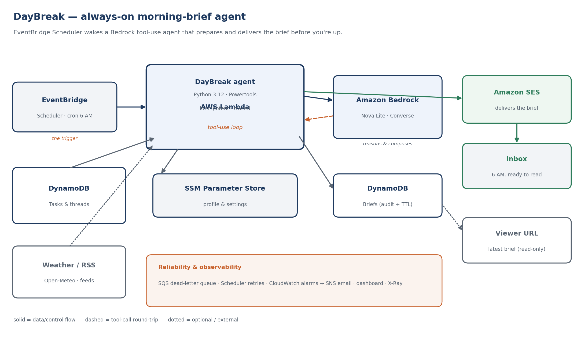

# DayBreak — an always-on morning-brief agent

DayBreak is a personal AI agent that runs on a schedule, does the work while you sleep, and has a single, scannable brief waiting in your inbox before you wake up. No app to open, no button to press. It wakes at 6 AM, gathers your day from real data sources, reasons over it with Amazon Bedrock (Nova), and emails you the result — with ready-to-send nudges for anything that's gone quiet.

Built for the **Build an Always-On Agent Weekend Challenge**.



## What it does

Every morning the agent:

1. **Wakes on a schedule** — EventBridge Scheduler fires at 6 AM in your timezone. No human in the loop.
2. **Gathers your day** — it calls tools for today's weather, your open tasks (overdue and due-today first), threads that have gone stale, and optional news headlines.
3. **Reasons and composes** — Bedrock Nova runs a tool-use loop: it decides which tools to call, reads the results, then writes a structured brief including short, paste-ready follow-up drafts for stale threads.
4. **Reports back** — it emails a clean HTML brief via SES and stores the record in DynamoDB. A read-only Function URL shows the latest brief on the web.

It's an *agent*, not a script: Nova chooses which tools to call each morning based on what data exists, rather than following a fixed sequence.

## Architecture

| Concern | Service |
| --- | --- |
| Trigger | Amazon EventBridge Scheduler (cron, timezone-aware) |
| Compute | AWS Lambda (Python 3.12, arm64) |
| Reasoning | Amazon Bedrock — Nova Lite via the Converse API with tool use |
| State | Amazon DynamoDB (tasks, briefs with TTL, idempotency) |
| Config | AWS Systems Manager Parameter Store (retune without redeploy) |
| Delivery | Amazon SES |
| Reliability | SQS dead-letter queue, Scheduler retries, Powertools idempotency |
| Observability | CloudWatch alarms → SNS email, dashboard, X-Ray tracing, EMF metrics |
| Viewer | Lambda Function URL (read-only) |

Everything is defined in `template.yaml` (AWS SAM) with least-privilege IAM scoped per action.

## Repository layout

```
src/agent/
  app.py          Lambda handler: orchestration, idempotency, metrics, error handling
  agent_core.py   Bedrock Converse tool-use loop -> structured Brief
  tools.py        The tools Nova can call (weather, tasks, stale threads, headlines)
  renderer.py     Brief -> HTML + plain-text email
  delivery.py     SES send + DynamoDB persistence
  viewer.py       Read-only "latest brief" Function URL handler
  config.py       SSM + env config loader
  models.py       Typed Brief / PriorityItem / FollowUp
template.yaml     SAM: scheduler, Lambda, tables, SES, DLQ, alarms, dashboard, IAM
scripts/          seed_data.py (demo data), local_invoke.py (offline end-to-end)
tests/            Unit tests for parsing, mapping, rendering
architecture/     diagram.py + rendered PNG
docs/ARTICLE.md   The Builder Center submission article
```

## Deploy

Prerequisites: an AWS account, the AWS SAM CLI, Python 3.12 on your PATH for `sam build` (or Docker for `sam build --use-container`), and Bedrock model access enabled for Nova Lite in your region.

```bash
sam build
sam deploy --guided \
  --parameter-overrides \
    SenderEmail=you@example.com \
    RecipientEmail=you@example.com \
    AlarmEmail=you@example.com \
    UserName="Your Name" \
    Latitude=33.749 Longitude=-84.388 \
    ScheduleTimezone=America/New_York
```

Then:

1. **Verify email** — SES starts in sandbox; confirm the verification emails sent to your sender and recipient addresses. Confirm the SNS alarm subscription too.
2. **Seed data** — `python scripts/seed_data.py --user default --region us-east-1`.
3. **Test now** — invoke once without waiting for 6 AM:
   ```bash
   aws lambda invoke --function-name daybreak-agent --payload '{}' /dev/stdout
   ```
4. **Watch it fire on its own** — the schedule runs daily; the CloudWatch dashboard (`DayBreak`) shows briefs sent, tools used, and DLQ depth.

The stack outputs a **Viewer URL** (the latest brief as a web page) you can use as the submission's app link.

## Develop and test locally

```bash
pip install -r src/requirements.txt pytest
python -m pytest tests/ -q          # unit tests, no AWS needed
python scripts/local_invoke.py      # full pipeline with AWS + Bedrock mocked -> OS temp dir preview
```

## Design decisions

- **Agentic, not scripted.** A tool-use loop lets Nova skip empty sections (no headlines feed → no headlines section) and spend its reasoning where the data is, which reads more naturally than a fixed template.
- **Structured output over prose.** The final turn is forced to strict JSON, so one payload drives the email, the stored record, and the viewer without re-parsing model text.
- **Idempotent by date.** At-least-once scheduling (a retry, a double-fire) never sends two briefs for the same morning — the first result is replayed from the idempotency store.
- **Degrade, don't fail.** A dead weather API or an empty task table drops that section; only a delivery/compose failure raises, which trips the alarm and lands the run in the DLQ.
- **Retune without redeploy.** Recipient, feeds, tone, and the stale threshold live in Parameter Store, editable in the console.

## Cost

Runs comfortably inside the AWS Free Tier: one short Lambda invocation per day, a handful of DynamoDB on-demand operations, one SES email, and a small number of Nova Lite tokens. Practically cents per month at personal scale.
