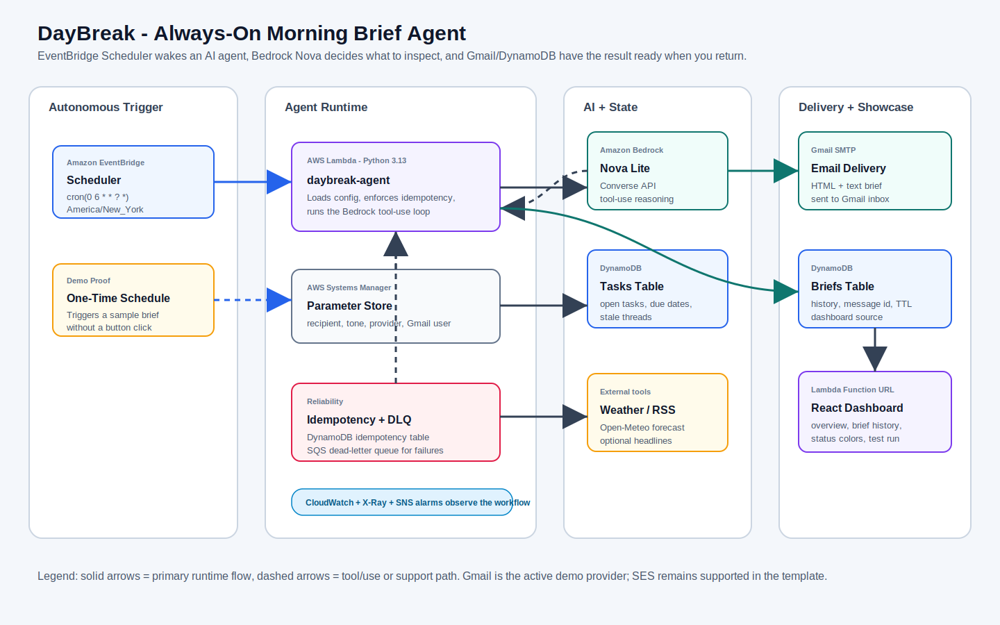
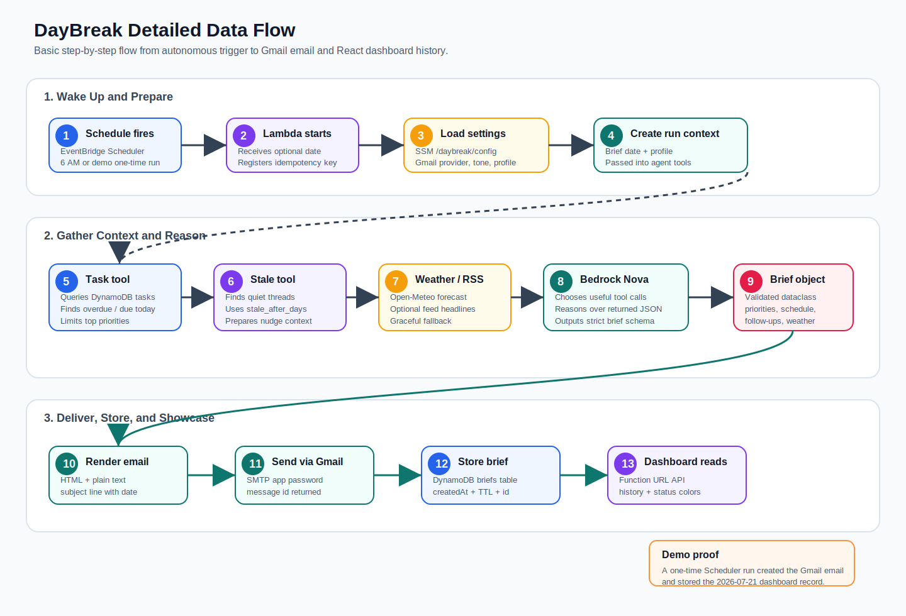

# Weekend Agent Challenge: DayBreak — An Always-On Morning Brief Agent

**Tag:** #agents

DayBreak is a personal AI-powered agent that prepares my morning before I open an app, check a dashboard, or click a button. It wakes up on its own, gathers the parts of my day that usually live in different places, asks Amazon Bedrock Nova to reason over them, and sends me a clear brief with priorities, weather, schedule items, and ready-to-send follow-up drafts.

The idea is simple: the best productivity tool is not another screen I need to remember to open. It is the assistant that quietly does the first pass while I am away and leaves the result waiting.

*Figure 1 — DayBreak AWS architecture.*

*Figure 2 — DayBreak data flow from schedule trigger to delivered result.*

## Vision & What the Agent Does

Every morning has the same small tax: check what is overdue, remember what is due today, look for work threads that have gone quiet, scan the weather, and decide what actually matters. DayBreak is built to remove that morning reconstruction step.

The agent is triggered by **Amazon EventBridge Scheduler** at 6 AM in `America/New_York`. There is no primary “Generate” button workflow. The scheduled event invokes the `daybreak-agent` Lambda function, and the agent does the work by itself.

On each run, DayBreak gathers:

- Open tasks from DynamoDB, with overdue and due-today items surfaced first
- Stale threads that have not been updated past the configured threshold
- Weather for the configured location through Open-Meteo
- Optional RSS headlines when a feed is configured
- Runtime preferences such as tone, recipient, and delivery provider from Systems Manager Parameter Store

Then Amazon Bedrock Nova Lite runs a tool-use loop. Nova decides which tools to call, reads the JSON results, and composes a structured brief. The final output includes a greeting, weather summary, top priorities, schedule suggestions, stale-thread nudges, optional headlines, and a closing line.

DayBreak reports back in two ways:

- It sends a polished HTML/plain-text email through Gmail SMTP for the demo deployment.
- It stores the brief in DynamoDB so the React dashboard can show history, status colors, and proof of previous runs.

For demo proof, I also created a one-time EventBridge Scheduler run that generated and emailed a `2026-07-21` brief. The dashboard now shows multiple generated briefs, including the scheduler-created result.

Live dashboard: `https://jnwpjyke5yiiweh7bc2ra2sclu0gmbba.lambda-url.us-east-1.on.aws/`

## How You Built It

I built DayBreak as an AWS SAM application with two Lambda functions: one for the autonomous agent and one for the dashboard/API. I started with the core agent path first: schedule input, config loading, tool calls, Bedrock reasoning, email rendering, and DynamoDB persistence. Once that worked, I added the dashboard so the result was easy to showcase.

The biggest implementation choice was making the system **agentic rather than scripted**. A simpler version could have called weather, tasks, stale threads, and headlines in a fixed order and then stuffed everything into a template. Instead, I exposed those capabilities as tools to Bedrock Nova. Nova can decide what to inspect and then produce the final structured brief from the real context it received.

Some key decisions:

- **Structured output.** The final Bedrock response is forced into a JSON shape. That lets the same payload drive the email, the DynamoDB record, and the dashboard without scraping prose.
- **Idempotency.** Scheduler invocations are at-least-once, so the agent is keyed by brief date using AWS Lambda Powertools idempotency with DynamoDB. Retries do not create duplicate emails for the same date.
- **Graceful tool failure.** Weather or RSS failures should not kill the whole morning brief. Tool functions return empty sections or clear error payloads so the agent can still produce useful output.
- **Operational visibility.** Failures raise errors so Lambda, CloudWatch alarms, SNS notifications, and the SQS dead-letter queue can make problems visible.
- **Demo-friendly delivery.** SES worked and remains supported, but Gmail SMTP was added as an optional provider for a more reliable demo inbox experience.

One challenge I hit was the Bedrock Converse tool-use protocol. After Nova used tools, the final formatting call still needed `toolConfig` because the message history contained `toolUse` and `toolResult` blocks. I fixed that and added a regression test so the final Bedrock turn always includes tool configuration.

Another challenge was showcasing the “always-on” behavior. A dashboard alone can make the app feel button-driven, so I added an Overview tab that shows the schedule, AWS services, autonomous flow, and generated brief history. The UI uses a pizza-tracker-style flow: scheduled wake-up, agent starts, inputs gathered, Nova reasons, and results delivered.

## AWS Services Used / Architecture Overview

DayBreak runs on AWS Free Tier-friendly services:

- **Amazon EventBridge Scheduler** — the autonomous trigger. The main schedule runs daily at 6 AM.
- **AWS Lambda** — Python 3.13 runtime for the agent and dashboard/API.
- **Amazon Bedrock Nova Lite** — the reasoning engine using the Converse API with tool use.
- **Amazon DynamoDB** — stores tasks, generated briefs, and idempotency records.
- **AWS Systems Manager Parameter Store** — stores runtime configuration such as tone, timezone, recipient, and delivery provider.
- **Amazon SQS** — dead-letter queue for failed scheduled runs.
- **Amazon CloudWatch** — logs, metrics, dashboard, and alarms.
- **Amazon SNS** — alarm notifications.
- **AWS X-Ray** — traces Lambda execution.
- **AWS SAM / CloudFormation** — repeatable infrastructure deployment.
- **Gmail SMTP** — demo email delivery provider. SES remains supported in the template.

The basic architecture is:

`EventBridge Scheduler → Lambda agent → Bedrock Nova tool loop → Gmail email + DynamoDB brief history → React dashboard`

The tool loop reads from DynamoDB for tasks and stale threads, calls external APIs for weather and optional headlines, and sends all useful context back to Nova. Nova produces strict JSON, the renderer turns it into email, and the storage layer writes the audit record to DynamoDB.

The React dashboard is served by a Lambda Function URL. Public users can view the generated brief history, while settings and manual test runs are protected by an admin token.

## What You Learned

The main lesson was that an always-on agent is less about a clever prompt and more about reliability boundaries. If something runs while I am asleep, then retries, idempotency, alarms, and graceful degradation are part of the product, not extra polish.

I also learned how practical Bedrock Converse tool use can be for personal automation. Letting Nova choose tools made the brief feel less like a rigid report and more like an assistant deciding what mattered that morning. At the same time, forcing a structured JSON final response kept the system safe to render, store, and display.

The UI work taught me something too: for an autonomous agent, the dashboard should prove that work happened without making the dashboard feel like the product. The Overview tab, scheduler proof, status-colored brief history, and data-flow diagrams all help tell that story quickly.

## Link to App or Repo

- **Live deployed dashboard:** `https://jnwpjyke5yiiweh7bc2ra2sclu0gmbba.lambda-url.us-east-1.on.aws/`
- **Public GitHub repository:** `https://github.com/parthi1914/daybreak-agent`

Built and deployed on AWS for the Weekend Agent Challenge. The current dashboard includes generated briefs, Gmail-delivered demo email proof, and a scheduled-run history suitable for submission screenshots.
